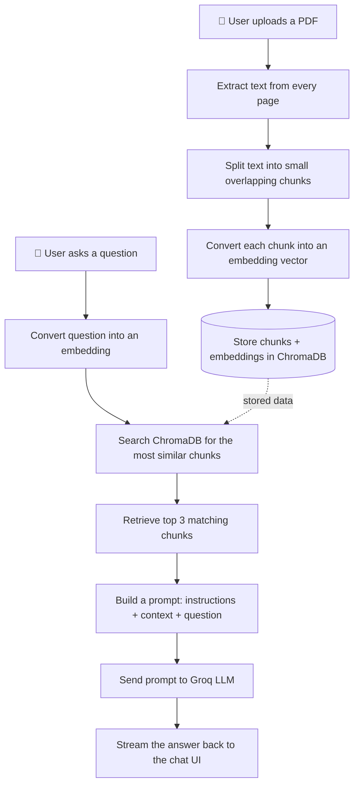

# Dev Samaj — BEST AI RAG Workshop

Welcome! This guide will take you from **zero setup** to a **working RAG chatbot running on your own machine**, and finally to **deploying it live on the internet**. It's written for beginners — every command is explained in plain language, so don't worry if you've never used Git or built an AI app before.

Take your time. Read each section before running the commands in it.

---

## Table of Contents

1. [What is RAG? (Quick Overview)](#1-what-is-rag-quick-overview)
2. [What You Will Build](#2-what-you-will-build)
3. [Before You Begin: Setup Checklist](#3-before-you-begin-setup-checklist)
4. [Fork, Clone & Set Up the Project](#4-fork-clone--set-up-the-project)
5. [RAG Workflow Diagram](#5-rag-workflow-diagram)
6. [Project Folder Structure](#6-project-folder-structure)
7. [Understanding requirements.txt](#7-understanding-requirementstxt)
8. [Code Walkthrough](#8-code-walkthrough)
9. [Submitting Your Project](#9-submitting-your-project)
10. [Deploying Your App on Streamlit Community Cloud](#10-deploying-your-app-on-streamlit-community-cloud)
11. [Final Checklist & Tips](#11-final-checklist--tips)

---

## 1. What is RAG? (Quick Overview)

**RAG** stands for **Retrieval-Augmented Generation**. In simple words: it's a way to make an AI chatbot answer questions using *your own documents*, instead of only what it learned during training.

Think of it like an **open-book exam**:
- A normal AI model answers from memory (closed-book) — it might guess, forget, or make things up.
- A RAG system lets the AI **look up the exact page in your document** before answering (open-book) — so its answers are grounded in real, verifiable content.

RAG has three moving parts:
| Part | What it does |
|---|---|
| **Retrieval** | Find the most relevant pieces of your document for the question asked |
| **Augmentation** | Insert those pieces into the AI's instructions as "context" |
| **Generation** | The AI writes an answer using only that context |

That's it. Everything you build in this workshop is one working example of this pattern.

---

## 2. What You Will Build

A **PDF Chat Assistant** — a web app where you:
1. Upload any PDF
2. Ask questions about it in a chat interface
3. Get answers generated only from that PDF's content, streamed back word-by-word

By the end, you'll understand every line of code that makes this happen — not just how to run it, but *why* it works.

---

## 3. Before You Begin: Setup Checklist

Complete all five items below before touching any code. Check them off as you go.

### ☐ 3.1 Install Python 3.12

We are specifically using **Python 3.12** for this workshop. Python 3.13 and 3.14 are newer and currently cause dependency issues with some of the AI libraries we use (like `torch` and `chromadb`), which may not yet fully support them. Using 3.12 avoids these problems entirely.

**Download:** [python.org/downloads](https://www.python.org/downloads/release/python-3120/)

**Windows:**
- Run the installer.
- ✅ Check **"Add python.exe to PATH"** at the bottom of the first screen — this is important, don't skip it.
- ✅ Also make sure the **py launcher** option is installed (it usually is, by default).

**macOS:**
- Use the official installer from the link above, **or** if you have [Homebrew](https://brew.sh/) installed:
  ```bash
  brew install python@3.12
  ```

**Linux (Ubuntu/Debian):**
```bash
sudo apt update
sudo apt install python3.12 python3.12-venv
```
*(If `python3.12` isn't available in your default repositories, use the [deadsnakes PPA](https://launchpad.net/~deadsnakes/+archive/ubuntu/ppa) or [pyenv](https://github.com/pyenv/pyenv).)*

**Verify it installed correctly:**

| OS | Command |
|---|---|
| Windows | `py -3.12 --version` |
| macOS/Linux | `python3.12 --version` |

You should see something like `Python 3.12.x`. If you don't, close and reopen your terminal and try again.

---

### ☐ 3.2 Understand: Isolated Environments

We'll create a **virtual environment** (a self-contained folder with its own Python packages) for this project. We'll actually set this up in [Section 4](#4-fork-clone--set-up-the-project) — for now, just know **why** we do this:

> If you install packages globally on your system, different projects can require different, conflicting versions of the same package — breaking each other. A virtual environment keeps each project's packages completely separate, like giving each project its own private toolbox.

---

### ☐ 3.3 Create a Groq Account & API Key

Groq is the service that runs the AI model (the "brain" that generates answers). You need a free API key to use it.

1. Go to [console.groq.com](https://console.groq.com)
2. Sign up (GitHub or Google sign-in is fastest)
3. Once logged in, go to **API Keys** in the left sidebar
4. Click **Create API Key**, give it a name (e.g., `rag-workshop`)
5. **Copy the key immediately** — Groq only shows it to you once. Paste it somewhere safe temporarily (you'll add it to your project in Section 4).

> 🔒 **Never share this key or upload it to GitHub.** Treat it like a password.

---

### ☐ 3.4 Create a Hugging Face Account & Token

Hugging Face hosts the small AI model we use to convert text into "embeddings" (explained later). A token lets you download it without hitting rate limits — especially important since everyone in the workshop will be downloading it around the same time.

1. Go to [huggingface.co/join](https://huggingface.co/join) and create a free account
2. Go to [huggingface.co/settings/tokens](https://huggingface.co/settings/tokens)
3. Click **Create new token**
4. Name it (e.g., `rag-workshop`) and set the role to **Read** (this is all you need — no write access required)
5. Copy the token and keep it safe alongside your Groq key

---

### ☐ 3.5 Create a Streamlit Account

Streamlit is the tool we use to turn our Python code into a web app, and later, to publish it live on the internet for free.

1. Go to [share.streamlit.io](https://share.streamlit.io)
2. Click **Sign up** and choose **Continue with GitHub** (recommended — this links your account directly to your repositories, which makes deployment in Section 10 much easier)
3. Authorize Streamlit to access your GitHub account when prompted

You won't need this again until Section 10, but it's good to have it ready now.

---

## 4. Fork, Clone & Set Up the Project

### What Does "Fork" Mean?

A **fork** is your own personal copy of someone else's GitHub repository, saved under *your* GitHub account. You can freely make changes to your fork without affecting the original. Later, you can propose your changes back to the original repository through a **Pull Request** — that's how you'll submit your final project.

### Step 1 — Fork the Repository

**What to fork:** The official workshop repository, which contains this reference RAG app plus the folder where all participants submit their projects.

**Where:** [github.com/Dev-Samaj/BEST-AI-RAG-Workshop](https://github.com/Dev-Samaj/BEST-AI-RAG-Workshop)

**How:**
1. Open the link above
2. Click the **Fork** button in the top-right corner of the page
3. Leave the settings as default and click **Create fork**

You'll be redirected to your own copy at `github.com/YOUR-USERNAME/BEST-AI-RAG-Workshop`.

---

### Step 2 — Clone Your Fork

"Cloning" downloads your forked repository from GitHub onto your computer so you can work on it locally.

Open a terminal (Command Prompt/PowerShell on Windows, Terminal on macOS/Linux) and run:

```bash
git clone https://github.com/YOUR-USERNAME/BEST-AI-RAG-Workshop.git
cd BEST-AI-RAG-Workshop
```

*Replace `YOUR-USERNAME` with your actual GitHub username.*

| Command | What it does |
|---|---|
| `git clone <url>` | Downloads a full copy of the repository (all files and history) to your computer |
| `cd BEST-AI-RAG-Workshop` | "Change directory" — moves your terminal into the newly downloaded folder so future commands apply there |

---

### Step 3 — Open in VS Code

```bash
code .
```

| Command | What it does |
|---|---|
| `code .` | Opens VS Code with the current folder (`.` means "this folder") as the project workspace |

*If this doesn't work, open VS Code manually and use File → Open Folder to select the `BEST-AI-RAG-Workshop` folder.*

From here on, you can run all commands either in VS Code's built-in terminal (Terminal → New Terminal) or your regular system terminal — both work identically.

---

### Step 4 — Create a Virtual Environment

This creates the isolated "toolbox" mentioned earlier.

**Windows:**
```bash
py -3.12 -m venv venv
venv\Scripts\activate
```

**macOS/Linux:**
```bash
python3.12 -m venv venv
source venv/bin/activate
```

| Command | What it does |
|---|---|
| `py -3.12 -m venv venv` / `python3.12 -m venv venv` | Creates a new folder called `venv` containing an isolated copy of Python 3.12 and a private space for packages |
| `venv\Scripts\activate` / `source venv/bin/activate` | "Activates" the environment — from now on, any `pip install` or `python` command in this terminal uses this isolated copy instead of your system-wide Python |

You'll know it worked if you see `(venv)` appear at the start of your terminal prompt. **You need to run the activate command every time you open a new terminal for this project.**

---

### Step 5 — Install Dependencies

```bash
pip install -r requirements.txt
```

| Command | What it does |
|---|---|
| `pip install -r requirements.txt` | `pip` is Python's package installer. `-r requirements.txt` tells it to read the list of packages from that file and install all of them, one by one |

This may take a few minutes — it's downloading several AI libraries. Grab a coffee.

> ⚠️ **Important fix needed:** the provided `requirements.txt` is missing `python-dotenv`, which the code needs to read your `.env` file. Add it before installing — see [Section 7](#7-understanding-requirementstxt) for the corrected file.

---

### Step 6 — Add Your Environment Variables

Create a file named `.env` in the project root (same folder as `app.py`) with this content:

```
GROQ_API_KEY=your_groq_api_key_here
HF_TOKEN=your_huggingface_token_here
```

Paste in the actual keys you copied in Sections 3.3 and 3.4, replacing the placeholder text.

> 🔒 **Never commit this file to Git.** We'll make sure Git ignores it automatically below.

Create a `.gitignore` file (if one doesn't already exist) with:
```
.env
venv/
__pycache__/
```

| Line | What it does |
|---|---|
| `.env` | Tells Git to never track or upload this file — keeps your API keys private |
| `venv/` | Prevents your entire virtual environment folder (thousands of files) from being uploaded |
| `__pycache__/` | Ignores Python's auto-generated cache files, which don't need to be shared |

---

### Step 7 — Run the App

```bash
streamlit run app.py
```

| Command | What it does |
|---|---|
| `streamlit run app.py` | Starts a local web server and opens the app in your browser at `http://localhost:8501` |

If you see the "PDF Chat Assistant" page load, you're fully set up. 🎉

---

### Git Basics: Commit & Push (When and How)

As you build or modify your own project (in your submission folder — see [Section 9](#9-submitting-your-project)), you'll save your progress using **commits**. Think of a commit as a checkpoint/save-point you can always return to.

**When to commit:** After completing each meaningful step or feature — not just once at the very end. For example:

```
✅ Set up the basic Streamlit page
✅ Added PDF upload and text extraction
✅ Added chunking and embeddings
✅ Connected the vector database
✅ Connected the Groq LLM and got a response working
✅ Polished the UI and wrote the README
```

Each of these could be its own commit. This gives you a clean history and makes it easy to undo a mistake without losing everything.

**The basic commit cycle:**

```bash
git status
git add .
git commit -m "Add PDF upload and text extraction"
git push
```

| Command | What it does |
|---|---|
| `git status` | Shows which files you've changed since your last commit — good habit to check before committing |
| `git add .` | "Stages" all your changed files, marking them as ready to be included in the next commit (`.` means "everything in this folder") |
| `git commit -m "message"` | Saves a checkpoint of your staged changes, with a short description of what you did |
| `git push` | Uploads your commits from your computer up to your fork on GitHub |

Write commit messages that describe *what changed*, e.g. `"Add chunking logic"` — not vague ones like `"update"` or `"fix"`.

---

## 5. RAG Workflow Diagram

Here's how data flows through the app, from PDF upload to final answer:



**In plain words:** uploading a PDF happens once and builds a searchable knowledge base. Every question you ask afterward searches that knowledge base for relevant pieces, hands them to the AI along with your question, and streams back an answer grounded in your document.

---

## 6. Project Folder Structure

```
BEST-AI-RAG-Workshop/
├── app.py               # Main Streamlit app — the UI and overall flow
├── pdf_processor.py      # Extracts text from PDFs and splits it into chunks
├── vector_store.py        # Creates embeddings and manages the ChromaDB database
├── prompts.py              # Builds the instruction text sent to the AI
├── groq_client.py           # Connects to Groq and streams the AI's answer
├── requirements.txt          # List of Python packages this project needs
├── .env                        # Your private API keys (never uploaded to GitHub)
├── .gitignore                   # Tells Git which files to ignore
├── CONTRIBUTING.md               # Rules for submitting your project
├── README.md                      # This file
└── submissions/                    # Where every participant's project lives
    └── YOUR-GITHUB-USERNAME/        # Your submission folder (you'll create this)
```

| File | Purpose in one line |
|---|---|
| `app.py` | Ties everything together — the page you actually see and interact with |
| `pdf_processor.py` | Turns a PDF into clean, bite-sized pieces of text |
| `vector_store.py` | Turns text into searchable "meaning vectors" and stores/searches them |
| `prompts.py` | Writes the exact instructions the AI follows to stay grounded in your document |
| `groq_client.py` | Handles the actual network call to the AI model |

---

## 7. Understanding requirements.txt

Here is the **corrected** list (with the missing package added):

```
streamlit
chromadb
sentence-transformers
pypdf
groq
torchvision
python-dotenv
```

| Package | What it does | Why we need it |
|---|---|---|
| `streamlit` | A Python framework for building web apps without writing HTML/CSS/JavaScript | Powers our entire chat interface, file uploader, and buttons |
| `chromadb` | A lightweight vector database | Stores our document chunks as searchable embeddings and finds the closest matches to a question |
| `sentence-transformers` | Loads pretrained AI models that convert text into numeric vectors ("embeddings") | Used to turn both document chunks and user questions into a comparable numeric form |
| `pypdf` | A library for reading PDF files | Extracts raw text from each page of an uploaded PDF |
| `groq` | The official client for Groq's API | Sends our prompts to the LLM and streams back responses |
| `torchvision` | A companion library in the PyTorch ecosystem | Not called directly in our code, but required behind the scenes by `sentence-transformers`'s dependencies — including it prevents confusing warning messages in your terminal |
| `python-dotenv` | Reads key-value pairs from a `.env` file | Lets our code securely load `GROQ_API_KEY` and `HF_TOKEN` without hardcoding them |

---

## 8. Code Walkthrough

We'll go file by file, in the order data flows through the app. For each file: full code first, then a plain-language breakdown split into **Imports** and **Functions**.

---

### 📄 `pdf_processor.py`

**Full Code:**
```python
from pypdf import PdfReader

def extract_text(uploaded_file):

    reader = PdfReader(uploaded_file)
    text = ""

    for page in reader.pages:
        text += page.extract_text() + "\n\n"

    return text

def chunk_text(text, chunk_size, overlap):

    chunks = []
    start = 0

    while start < len(text):
        chunk = text[start : start + chunk_size]
        chunks.append(chunk)

        start += chunk_size - overlap

    return chunks
```

**A) Imports**
```python
from pypdf import PdfReader
```
- Imports the `PdfReader` class from the `pypdf` library. This class knows how to open a PDF file and read its pages one at a time.

**B) Function: `extract_text(uploaded_file)`**

Pulls all the readable text out of a PDF.

- `reader = PdfReader(uploaded_file)` — creates a reader object pointed at the uploaded PDF, giving us access to its pages.
- `text = ""` — starts an empty string that we'll build up piece by piece.
- `for page in reader.pages:` — loops through every page in the PDF, one at a time.
- `text += page.extract_text() + "\n\n"` — pulls the text from the current page and appends it to our growing string, adding two newlines afterward so pages don't run together.
- `return text` — once every page has been processed, sends back the full combined text.

**C) Function: `chunk_text(text, chunk_size, overlap)`**

Breaks a long string of text into smaller overlapping pieces, since AI models work better with small, focused chunks rather than one huge block.

- `chunks = []` — an empty list that will hold each piece of text.
- `start = 0` — a pointer tracking our current position in the text.
- `while start < len(text):` — keep looping until we've covered the entire text.
- `chunk = text[start : start + chunk_size]` — slices out `chunk_size` characters starting from `start` (in `app.py`, this is called with `chunk_size=300`).
- `chunks.append(chunk)` — adds this piece to our list.
- `start += chunk_size - overlap` — moves the pointer forward, but *not* by the full chunk size — by `chunk_size - overlap` instead. This means each new chunk re-includes the last `overlap` characters (75, in our case) of the previous one.
- `return chunks` — returns the complete list once we've reached the end.

> 💡 **Why overlap?** If a sentence gets cut off right at a chunk boundary, the overlap ensures that sentence still appears in full in the *next* chunk too — so we don't lose meaning at the edges.

---

### 📄 `groq_client.py`

**Full Code:**
```python
import os
from dotenv import load_dotenv

from groq import Groq

client = None

def ask_llm(prompt):
    global client

    if client is None:
        load_dotenv()
        api_key=os.environ.get("GROQ_API_KEY")

        if not api_key:
            raise ValueError("GROQ_API_KEY is not set. Add it to your environment or .env file.")
        
        client = Groq(api_key=api_key)

    stream = client.chat.completions.create(
        model="llama-3.3-70b-versatile",
        messages=[
            {
                "role": "user",
                "content": prompt
            }
        ],
        temperature=0,
        max_completion_tokens=512,
        top_p=1,
        stream=True
    )

    for chunk in stream:
        content = chunk.choices[0].delta.content

        if content:
            yield content
```

**A) Imports**
```python
import os
from dotenv import load_dotenv
from groq import Groq

client = None
```
- `import os` — Python's built-in module for interacting with your system, including reading environment variables (where we'll store our secret API key).
- `from dotenv import load_dotenv` — imports the function that reads your `.env` file and loads its contents into the environment so `os` can see them.
- `from groq import Groq` — imports the `Groq` class, the official tool for sending requests to Groq's AI models.
- `client = None` — a placeholder variable, defined once outside any function, that will eventually hold our live connection to Groq. It starts empty so we don't accidentally create a new connection on every single question.

**B) Function: `ask_llm(prompt)`**

Sends a prompt to the AI and streams back its answer piece by piece.

- `global client` — tells Python: "use the `client` variable defined outside this function, don't create a new local one." This lets us reuse the same connection across multiple calls.
- `if client is None:` — only runs the setup code the *first* time this function is called. On every call after that, we skip straight to sending the message.
  - `load_dotenv()` — loads the `.env` file's contents.
  - `api_key = os.environ.get("GROQ_API_KEY")` — reads the API key from the environment.
  - `if not api_key: raise ValueError(...)` — if no key was found, stop immediately with a clear, helpful error instead of a confusing crash later.
  - `client = Groq(api_key=api_key)` — creates the actual connection object, now saved for future reuse.
- `stream = client.chat.completions.create(...)` — sends the request to the AI. Here's what each setting means:
  - `model="llama-3.3-70b-versatile"` — which AI model to use.
  - `messages=[{"role": "user", "content": prompt}]` — the message itself, formatted the way chat-based AI APIs expect.
  - `temperature=0` — controls randomness/creativity. `0` means the most focused, predictable answers — ideal for factual document Q&A where we don't want creative guessing.
  - `max_completion_tokens=512` — caps how long the answer can be.
  - `top_p=1` — another randomness setting, left at its default (no extra restriction).
  - `stream=True` — instead of waiting for the whole answer, Groq sends it back in small pieces as it's generated.
- `for chunk in stream:` — loops through each small piece as it arrives.
  - `content = chunk.choices[0].delta.content` — pulls out just the new bit of text from this piece.
  - `if content: yield content` — if there's actual text (not empty), sends it out of the function immediately.

> 💡 **What does `yield` mean?** Using `yield` instead of `return` turns this function into a **generator**. Instead of running once and giving back one final answer, it pauses after each `yield`, hands out a small piece of text, and waits — resuming only when the next piece is requested. This is what lets the chat UI "type out" the answer live instead of showing it all at once.

---

### 📄 `vector_store.py`

**Full Code:**
```python
import uuid
from dotenv import load_dotenv

import chromadb
import streamlit as st
from sentence_transformers import SentenceTransformer

load_dotenv()

@st.cache_resource
def load_model():
    return SentenceTransformer('all-MiniLM-L6-v2')

client = chromadb.Client()

def get_collection():
    if "collection_name" not in st.session_state:
        st.session_state["collection_name"] = f"kb_{uuid.uuid4().hex}"
    return client.get_or_create_collection(name=st.session_state["collection_name"])

def add_to_knowledge_base(chunks):
    
    model = load_model()

    embeddings = model.encode(chunks).tolist()

    ids = [str(uuid.uuid4()) for _ in chunks]

    collection = get_collection()

    collection.add(
        ids=ids,
        documents=chunks,
        embeddings=embeddings
    )

def search_knowledge_base(query):

    model = load_model()

    query_embedding = model.encode(query).tolist()

    collection = get_collection()

    search_results = collection.query(
        query_embeddings=[query_embedding],
        n_results=3
    )
    
    return search_results["documents"][0]

def reset_knowledge_base():
    if "collection_name" in st.session_state:
        try:
            client.delete_collection(st.session_state["collection_name"])
        except Exception:
            pass
        del st.session_state["collection_name"]
```

**A) Imports**
```python
import uuid
from dotenv import load_dotenv
import chromadb
import streamlit as st
from sentence_transformers import SentenceTransformer

load_dotenv()

client = chromadb.Client()
```
- `import uuid` — Python's built-in tool for generating random, unique IDs. We use this to give every text chunk and every user session a unique name.
- `from dotenv import load_dotenv` — same purpose as before: lets us read the `.env` file.
- `import chromadb` — imports our vector database library.
- `import streamlit as st` — imports Streamlit, used here for two things: caching (`@st.cache_resource`) and remembering per-user data (`st.session_state`).
- `from sentence_transformers import SentenceTransformer` — imports the class used to load our text-to-vector embedding model.
- `load_dotenv()` — runs immediately when this file is loaded, making sure any environment variables (like `HF_TOKEN`) are available.
- `client = chromadb.Client()` — creates one shared, in-memory ChromaDB client for the whole app. "In-memory" means the data lives only in your computer's RAM while the app is running, and disappears when it stops.

**B) Function: `load_model()`**
```python
@st.cache_resource
def load_model():
    return SentenceTransformer('all-MiniLM-L6-v2')
```
- `@st.cache_resource` — this is a **decorator**, special Python syntax placed above a function to change its behavior. Here, it tells Streamlit: "run this function once, remember the result, and reuse it every time it's called again — don't reload the model from scratch each time." Without this, the app would reload the (fairly large) AI model on every single interaction, making it painfully slow.
- `return SentenceTransformer('all-MiniLM-L6-v2')` — loads a specific pretrained embedding model by name. This model's whole job is to read a piece of text and output a list of numbers (a vector) that represents its *meaning* — so texts with similar meaning end up with similar numbers.

**C) Function: `get_collection()`**
```python
def get_collection():
    if "collection_name" not in st.session_state:
        st.session_state["collection_name"] = f"kb_{uuid.uuid4().hex}"
    return client.get_or_create_collection(name=st.session_state["collection_name"])
```
- `if "collection_name" not in st.session_state:` — checks whether *this specific browser session* already has its own named "collection" (think of a collection like a private table in the database).
- `st.session_state["collection_name"] = f"kb_{uuid.uuid4().hex}"` — if not, generates a random unique name (e.g. `kb_a1b2c3...`) and saves it for this session only. This is what keeps different users' uploaded documents completely separate from each other.
- `return client.get_or_create_collection(...)` — fetches that collection from ChromaDB, creating it fresh if it doesn't exist yet.

**D) Function: `add_to_knowledge_base(chunks)`**
```python
def add_to_knowledge_base(chunks):
    model = load_model()
    embeddings = model.encode(chunks).tolist()
    ids = [str(uuid.uuid4()) for _ in chunks]
    collection = get_collection()
    collection.add(ids=ids, documents=chunks, embeddings=embeddings)
```
- `model = load_model()` — grabs the cached embedding model (instant after the first load).
- `embeddings = model.encode(chunks).tolist()` — converts every chunk of text into its numeric vector form, all at once.
- `ids = [str(uuid.uuid4()) for _ in chunks]` — generates one unique ID per chunk, so ChromaDB can reference each one individually.
- `collection = get_collection()` — gets this session's private collection.
- `collection.add(ids=ids, documents=chunks, embeddings=embeddings)` — stores everything together: the ID, the original text, and its embedding — all linked as one record per chunk.

**E) Function: `search_knowledge_base(query)`**
```python
def search_knowledge_base(query):
    model = load_model()
    query_embedding = model.encode(query).tolist()
    collection = get_collection()
    search_results = collection.query(query_embeddings=[query_embedding], n_results=3)
    return search_results["documents"][0]
```
- `model = load_model()` — same cached model.
- `query_embedding = model.encode(query).tolist()` — turns the *user's question* into a vector, using the exact same process as the document chunks — this is what makes them comparable.
- `collection = get_collection()` — this session's collection.
- `search_results = collection.query(query_embeddings=[query_embedding], n_results=3)` — asks ChromaDB: "of everything stored, find the 3 chunks whose vectors are mathematically closest to this question's vector."
- `return search_results["documents"][0]` — the result comes back in a nested structure; this line pulls out just the plain list of matching text chunks.

**F) Function: `reset_knowledge_base()`**
```python
def reset_knowledge_base():
    if "collection_name" in st.session_state:
        try:
            client.delete_collection(st.session_state["collection_name"])
        except Exception:
            pass
        del st.session_state["collection_name"]
```
- `if "collection_name" in st.session_state:` — only proceed if this session actually has an active collection to clear.
- `try: client.delete_collection(...) except Exception: pass` — attempts to delete the collection from ChromaDB; if it fails for any reason (e.g., already deleted), we quietly ignore the error rather than crashing the app.
- `del st.session_state["collection_name"]` — removes the reference so a brand-new collection will be created the next time someone uploads a PDF.

---

### 📄 `prompts.py`

**Full Code:**
```python
def build_prompt(context, question):

    context_text = "\n\n".join(context)

    return f"""
You are an expert document QA assistant.

If the user's message is a greeting, small talk, or general conversation (e.g. "hello", "hi", "how are you", "thanks"), respond naturally and briefly, and invite them to ask something about the document. Do not use the context for this.

For any actual question about the document's content, you must answer ONLY using the supplied context. Follow this process:
- Read the context carefully.
- If the answer is explicitly present, answer concisely.
- If the answer is missing, incomplete, or cannot be determined from the context, reply exactly:
"I couldn't find that information in the PDF."

Never use your own knowledge for document questions.
Never guess.
Never fabricate information.

Context:
----------------
{context_text}
----------------

Question:
{question}

Answer:
"""
```

**A) Function: `build_prompt(context, question)`**

This file has no external imports — it just builds a piece of text. Its whole job is to combine the retrieved chunks and the user's question into clear instructions for the AI.

- `context_text = "\n\n".join(context)` — `context` is a list of text chunks (from `search_knowledge_base`). `"\n\n".join(...)` glues them all together into one string, with a blank line between each chunk for readability.
- `return f"""..."""` — returns a big, multi-line instruction string. A few things to notice about how it's written:
  - The triple quotes (`"""`) let us write a string that spans multiple lines.
  - The `f` before the quotes makes it an **f-string** — this lets us drop live variable values directly inside using `{curly braces}`, like `{context_text}` and `{question}` near the bottom.
  - The instructions explicitly separate two behaviors: casual greetings get a friendly, free-form reply; real questions must be answered *strictly* from the context.
  - The fallback line — `"I couldn't find that information in the PDF."` — is critical: it gives the AI an exact, safe response to fall back on instead of guessing when the answer truly isn't in the document. This is the core trick that prevents hallucination in a RAG system.

---

### 📄 `app.py`

**Full Code:**
```python
import os

import streamlit as st

from pdf_processor import (extract_text, chunk_text)
from vector_store import (add_to_knowledge_base, search_knowledge_base, reset_knowledge_base)
from prompts import build_prompt
from groq_client import ask_llm

st.set_page_config(page_title="PDF Chat Assistant", layout="wide")
st.title("PDF Chat Assistant")
st.caption("Transform any PDF into an interactive conversation.")

with st.sidebar:
    st.header("Upload PDF")

    uploaded_file = st.file_uploader(
        "Choose a PDF",
        type=["pdf"],
        help="Supported format: PDF(.pdf)"
    )

    if uploaded_file:
        file_name = os.path.splitext(uploaded_file.name)[0]
        st.success(f"{file_name}")

    if uploaded_file and "db_ready" not in st.session_state:

        try:
            with st.spinner("Processing PDF...."):
                text = extract_text(uploaded_file)

                if text.strip() == "":
                    st.warning("This PDF contains no extractable text. It may be a scanned/image-only PDF.")
                    st.stop()

                chunks = chunk_text(text, 300, 75)

                add_to_knowledge_base(chunks)

                st.session_state["db_ready"] = True

        except Exception as e:
            st.error(f"Error: {e}")

    if st.session_state.get("db_ready"):
        if st.button("Start Over / Upload New PDF"):
            reset_knowledge_base()
            st.session_state.clear()
            st.rerun()

if "messages" not in st.session_state:
    st.session_state["messages"] = []

for msg in st.session_state["messages"]:
    with st.chat_message(msg["role"]):
        st.write(msg["content"])

user_search = st.chat_input("Ask your question...")

if user_search:

    st.session_state["messages"].append({"role": "user", "content":user_search})

    with st.chat_message("user"):
        st.write(user_search)

    if st.session_state.get("db_ready", False):

        try:
            context = search_knowledge_base(user_search)

            prompt = build_prompt(context, user_search)

            reply = ask_llm(prompt)

            with st.chat_message("assistant"):
                full_reply = st.write_stream(reply)

                st.session_state["messages"].append({"role":"assistant", "content":full_reply})
                
        except Exception as e:
            with st.chat_message("assistant"):
                st.error(f"Something went wrong while generating a response: {e}")
    else:
        with st.chat_message("assistant"):
            st.write("Please upload a PDF first.")
```

**A) Imports**
```python
import os
import streamlit as st
from pdf_processor import (extract_text, chunk_text)
from vector_store import (add_to_knowledge_base, search_knowledge_base, reset_knowledge_base)
from prompts import build_prompt
from groq_client import ask_llm
```
- `import os` — used later for a small filename operation.
- `import streamlit as st` — imports the whole UI framework we use to build the page.
- `from pdf_processor import (extract_text, chunk_text)` — brings in the two functions we walked through above.
- `from vector_store import (...)` — brings in the three vector database functions.
- `from prompts import build_prompt` — brings in our prompt builder.
- `from groq_client import ask_llm` — brings in our AI-calling generator function.

> 💡 Notice these imports only work if the filenames match exactly (`pdf_processor.py`, `vector_store.py`, etc.). If you rename a file, update the import here too, or you'll get a `ModuleNotFoundError`.

**B) Page Setup**
```python
st.set_page_config(page_title="PDF Chat Assistant", layout="wide")
st.title("PDF Chat Assistant")
st.caption("Transform any PDF into an interactive conversation.")
```
- `st.set_page_config(...)` — sets the browser tab's title and makes the page use the full width of the screen.
- `st.title(...)` — displays a large heading at the top of the page.
- `st.caption(...)` — displays small, muted subtitle text beneath it.

**C) Sidebar: PDF Upload & Ingestion**
```python
with st.sidebar:
    ...
```
- `with st.sidebar:` — everything indented under this line appears in the collapsible sidebar panel, not the main page.
- `uploaded_file = st.file_uploader(...)` — displays a file upload widget restricted to `.pdf` files; whatever the user uploads is stored in `uploaded_file`.
- `if uploaded_file:` block — if a file was uploaded, show a small success message with its name (using `os.path.splitext` to strip the `.pdf` extension for a cleaner display).
- `if uploaded_file and "db_ready" not in st.session_state:` — this is the key gate: only process the PDF if one was uploaded **and** we haven't already built a knowledge base in this session (prevents re-processing on every rerun).
  - `with st.spinner("Processing PDF...."):` — shows a loading spinner while the code inside runs.
  - `text = extract_text(uploaded_file)` — calls our `pdf_processor.py` function to pull out all the text.
  - `if text.strip() == "": ... st.stop()` — safety check: if no text could be extracted (e.g., a scanned image PDF with no real text layer), warn the user and halt execution right there.
  - `chunks = chunk_text(text, 300, 75)` — splits the text into chunks of 300 characters with 75 characters of overlap.
  - `add_to_knowledge_base(chunks)` — embeds and stores those chunks in ChromaDB.
  - `st.session_state["db_ready"] = True` — marks that this session now has a ready knowledge base, so the chat can proceed.
  - `except Exception as e: st.error(...)` — if anything above fails, show a readable error instead of crashing.
- `if st.session_state.get("db_ready"):` block — once a knowledge base exists, show a **"Start Over"** button.
  - `reset_knowledge_base()` — clears the ChromaDB collection (from `vector_store.py`).
  - `st.session_state.clear()` — wipes all session data (messages, flags, etc.), giving a completely fresh start.
  - `st.rerun()` — tells Streamlit to immediately restart the script from the top, refreshing the page.

**D) Chat History Display**
```python
if "messages" not in st.session_state:
    st.session_state["messages"] = []

for msg in st.session_state["messages"]:
    with st.chat_message(msg["role"]):
        st.write(msg["content"])
```
- `if "messages" not in st.session_state:` — the first time the app runs for a user, create an empty list to store the conversation.
- `for msg in st.session_state["messages"]:` — every time the page reruns (which Streamlit does after each interaction), replay the entire stored conversation so far.
  - `with st.chat_message(msg["role"]):` — displays a styled chat bubble, aligned differently depending on whether `role` is `"user"` or `"assistant"`.
  - `st.write(msg["content"])` — shows that message's text inside the bubble.

**E) Handling a New Question**
```python
user_search = st.chat_input("Ask your question...")

if user_search:
    st.session_state["messages"].append({"role": "user", "content": user_search})
    with st.chat_message("user"):
        st.write(user_search)
```
- `user_search = st.chat_input(...)` — displays the chat text box at the bottom of the page. It returns `None` until the user actually types something and hits enter.
- `if user_search:` — only run the block below if the user actually submitted a question.
- `st.session_state["messages"].append(...)` — saves the user's message into our running history.
- `with st.chat_message("user"): st.write(user_search)` — immediately displays the user's own message in the chat.

**F) Generating and Streaming the Answer**
```python
if st.session_state.get("db_ready", False):
    try:
        context = search_knowledge_base(user_search)
        prompt = build_prompt(context, user_search)
        reply = ask_llm(prompt)

        with st.chat_message("assistant"):
            full_reply = st.write_stream(reply)
            st.session_state["messages"].append({"role": "assistant", "content": full_reply})

    except Exception as e:
        with st.chat_message("assistant"):
            st.error(f"Something went wrong while generating a response: {e}")
else:
    with st.chat_message("assistant"):
        st.write("Please upload a PDF first.")
```
- `if st.session_state.get("db_ready", False):` — only try to answer if a PDF has actually been processed; otherwise, politely ask the user to upload one.
- `context = search_knowledge_base(user_search)` — retrieves the top 3 most relevant chunks for this question.
- `prompt = build_prompt(context, user_search)` — builds the full instruction text combining those chunks and the question.
- `reply = ask_llm(prompt)` — calls our generator function. **Important:** calling it here doesn't run any code yet — since `ask_llm` uses `yield`, this just creates a generator object, ready to produce text when asked.
- `with st.chat_message("assistant"):` — opens a new assistant-style chat bubble.
  - `full_reply = st.write_stream(reply)` — this is what actually starts running `ask_llm`, pulling out each piece of text as it streams in and displaying it live, typewriter-style. It also collects everything into one final string, which is returned and saved as `full_reply`.
  - `st.session_state["messages"].append(...)` — saves the *complete* final answer (not the generator itself) into our chat history, so it displays correctly if the page reruns later.
- `except Exception as e:` — catches any error (e.g., missing API key, network issue) and shows it clearly instead of crashing the whole app.

---

## 9. Submitting Your Project

Once your project (in your own submission folder) is working, follow these steps to submit it for review. Full rules are also in `CONTRIBUTING.md` — read that too before submitting.

### Step 1 — Create Your Branch
```bash
git checkout -b submission-YOUR-USERNAME
```
| Command | What it does |
|---|---|
| `git checkout -b submission-YOUR-USERNAME` | Creates a new **branch** — an independent line of work — and switches to it immediately. Working in your own branch keeps your submission separate from the main codebase until it's reviewed |

### Step 2 — Create Your Submission Folder
Inside the repo, create:
```text
submissions/YOUR-GITHUB-USERNAME/
```
Add your project files inside it — your own `app.py`, `requirements.txt`, and a `README.md` describing your project (see `CONTRIBUTING.md` for exactly what it should include).

### Step 3 — Commit Your Work
```bash
git add .
git commit -m "Add RAG project - YOUR-USERNAME"
```
*(See [Git Basics](#git-basics-commit--push-when-and-how) above for what each part means.)*

### Step 4 — Push Your Branch
```bash
git push origin submission-YOUR-USERNAME
```
| Command | What it does |
|---|---|
| `git push origin submission-YOUR-USERNAME` | Uploads your new branch (and its commits) to your fork on GitHub, under the name `submission-YOUR-USERNAME` |

### Step 5 — Open a Pull Request
1. Go to your fork on GitHub — you'll usually see a banner suggesting **"Compare & pull request"**. Click it.
2. Make sure the PR is set to merge into `Dev-Samaj/BEST-AI-RAG-Workshop` (the original repo, not your fork).
3. Add a short description of your project and submit the PR.

### Step 6 — Wait for Review
The Dev Samaj team will review your submission. Once accepted, it's merged in and will permanently appear at `submissions/YOUR-GITHUB-USERNAME/` in the official repo.

> ✅ You can submit even an incomplete project — partial, basic, or experimental work is all welcome. Just be honest about what's finished in your project's README.

---

## 10. Deploying Your App on Streamlit Community Cloud

Turn your local app into a live website anyone can visit — for free.

1. **Push your finished code** to your GitHub fork (your `submissions/YOUR-USERNAME/` folder, or your own separate repo if you prefer — either works, as long as it's on GitHub).
2. Go to [share.streamlit.io](https://share.streamlit.io) and log in (you already connected your GitHub account in [Section 3.5](#-35-create-a-streamlit-account)).
3. Click **Create app** → **"Deploy a public app from GitHub."**
4. Fill in the deployment form:
   - **Repository:** select your forked repo
   - **Branch:** select your submission branch (e.g., `submission-YOUR-USERNAME`)
   - **Main file path:** the path to your `app.py` (e.g., `submissions/YOUR-USERNAME/app.py`)
5. Click **"Advanced settings"** before deploying, and add your secrets — this is the safe, cloud equivalent of your local `.env` file:
   ```toml
   GROQ_API_KEY = "your_groq_api_key_here"
   HF_TOKEN = "your_huggingface_token_here"
   ```
6. Click **Deploy**. Streamlit will install your `requirements.txt` and start the app — this takes a few minutes the first time.
7. Once live, you'll get a public URL like `https://your-app-name.streamlit.app` — this is your shareable, working RAG chatbot!

> 💡 If your app crashes on deploy, check the logs (bottom-right "Manage app" panel) — it's almost always a missing package in `requirements.txt` or a missing secret.

---

## 11. Final Checklist & Tips

- ☐ Python 3.12 installed and verified
- ☐ Groq API key created and saved
- ☐ Hugging Face token created and saved
- ☐ Streamlit account created
- ☐ Repository forked and cloned
- ☐ Virtual environment created and activated
- ☐ Dependencies installed (including the added `python-dotenv`)
- ☐ `.env` file created (and confirmed it's in `.gitignore`, never committed)
- ☐ App runs locally with `streamlit run app.py`
- ☐ You understand what each file does, not just that it works
- ☐ Project committed in small, meaningful steps — not one giant commit
- ☐ Submission folder created under `submissions/YOUR-USERNAME/`
- ☐ Pull request opened against `Dev-Samaj/BEST-AI-RAG-Workshop`
- ☐ App deployed live on Streamlit Community Cloud

**A few closing tips:**
- If something breaks, read the actual error message in your terminal — it almost always tells you exactly what's wrong.
- Commit often. It's much easier to fix one small mistake than to untangle a huge one.
- Don't be afraid to experiment beyond the base app once it's working — try a different chunk size, a different number of retrieved chunks, or a different prompt wording, and see how the answers change.

Happy building! 🚀
**Dev Samaj**
